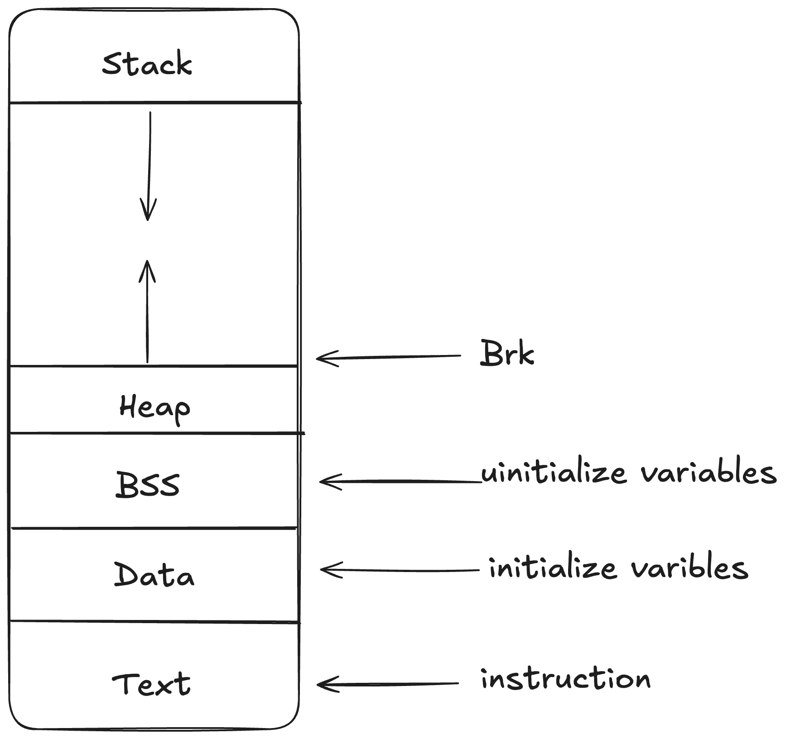

# Memory Allocator 

Simple memory allocator which is custom implementation of malloc(),calloc(),free() and realloc() using sbrk() system call .


## Screenshots




## Run Locally

Clone the project

```bash
  https://github.com/Megatrone750/Memory-Allocator.git
```

Go to the project directory

```bash
  cd Memory-Allocator
```

Compile the code and make the shared library

```bash
   gcc -o memalloc.so -fPIC -shared memalloc.c
```

On Linux, setting the `LD_PRELOAD` environment variable to the path of a shared object ensures that the specified file is loaded before any other library. This technique can be leveraged to load a custom-compiled library first, allowing subsequent commands in the shell to utilize your implementations of functions like `malloc()`, `free()`, `calloc()`, and `realloc()`.

```bash
  export LD_PRELOAD=$PWD/memalloc.so
```

Once you've set up `LD_PRELOAD` with your custom memory allocator library, you can test it by running a standard program like `ls`. If the library is working correctly, you should see output or behavior indicating that your custom `malloc()`, `free()`, `calloc()`, and `realloc()` functions are being used.

```bash
  ls
   memalloc.  memalloc.so 
```

 unset  LD_PRELOAD to make undo changes 
```bash
  unset LD_PRELOAD
```
